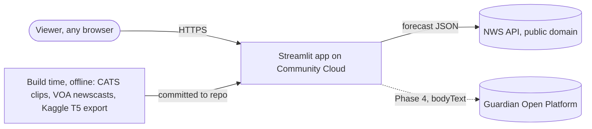
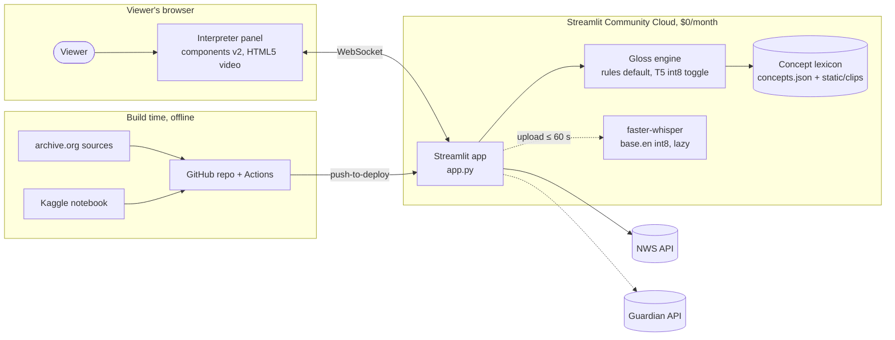
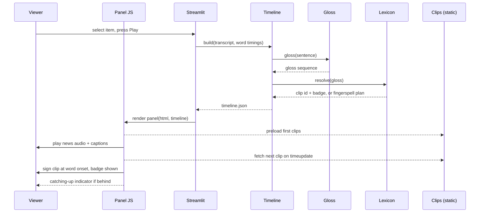

# Speak2Sign v2 — System Design (TRD)

**Date:** 2026-09-02 · **Status:** Proposed, awaiting developer approval
**Reads with:** [00-execution-plan.md](../00-execution-plan.md) · [contracts/timeline.schema.json](../../contracts/timeline.schema.json) · `docs/research/verification-2026-09-02-*.md`
**Diagrams (interactive HTML, open in a browser):** [System architecture](diagrams/speak2sign-system-architecture.html) · [Play a news item (sequence)](diagrams/speak2sign-play-item.html) · [Text to sign (data flow)](diagrams/speak2sign-text-to-sign.html). Each has a validated source JSON beside it and PNG captures for the report.

**Audience:** the developer, and the examiners assessing artefact and process.

---

## 1. Purpose and calibration

The system shows a news item on the left and an American Sign Language (ASL) interpreter panel on the right that signs the same content, in time with the narration, from recorded clips of Deaf signers. This document specifies what is built so that Phase 2 code can be written against it and tests can assert it.

Design is calibrated to five constraints, in priority order:

| # | Constraint | Consequence |
|---|---|---|
| 1 | One developer, 8 weeks, ~4 days/week | Every component buildable in days; the runtime has one language (Python) plus one small JS file |
| 2 | Assessed on process and artefact | The pipeline, contract, and documentation are deliverables |
| 3 | Must survive a live viva | The demo path is deterministic: pre-transcribed items, local clips, no server call during playback |
| 4 | $0 budget, 2.7 GB RAM ceiling, 0.078–2 cores | Memory is the primary engineering constraint; nothing heavy loads on the demo path |
| 5 | Accessibility project, honesty non-negotiable | Provenance per sign, overrun shown, disclaimer at first exposure |

The design principle that follows: **do the smallest number of things that are individually defensible, and refuse the rest on the record.**

---

## 2. Context



External actors and systems:

| Actor / system | Role | Trust |
|---|---|---|
| Viewer | Picks an item, presses Play, watches | Untrusted input only in upload mode |
| Streamlit Community Cloud | Hosts the app from the public GitHub repo | Runtime |
| NWS API (`api.weather.gov`) | Live forecast text, no key | Read-only, public data |
| Guardian Open Platform | Phase 4 headline text, free developer key in Community Cloud secrets | Read-only, non-commercial terms |
| archive.org | Build-time source of CATS sign clips (public domain) and VOA newscasts (public domain) | Offline only |
| Kaggle | Build-time T5 fine-tuning and CTranslate2 export | Offline only |

---

## 3. Component view

Rendered in [speak2sign-system-architecture.html](diagrams/speak2sign-system-architecture.html).



### 3.1 Responsibilities

| Component | Module | Responsibility | Must not |
|---|---|---|---|
| **Streamlit app** | `app.py` | Layout, item selection, lane routing, disclaimer and attribution block, calls into `src/` | Contain pipeline logic |
| **Ingest** | `src/speak2sign/ingest/{demo_set,nws,headlines}.py` | Produce a `TimedTranscript` from a curated item, the live forecast, a headline, or typed text | Make network calls during playback |
| **ASR** | `src/speak2sign/asr.py` | Transcribe an uploaded clip with word timestamps; lazy-load; enforce the 60 s cap; release the model when idle | Load on the demo path |
| **Gloss engine** | `src/speak2sign/gloss/{rules,t5}.py` | English sentence → gloss sequence. Rules by default; T5 via CTranslate2 when the toggle is on | Invent a sign form |
| **Lexicon** | `src/speak2sign/gloss/lexicon.py` + `data/lexicon/*.json` | Gloss → concept → clip file, source, licence, badge; fingerspelling plan for out-of-vocabulary tokens | Key on an English string alone |
| **Provenance** | `src/speak2sign/provenance.py` | Decide the badge for each entry and compute stats | Be bypassed by any lane |
| **Timeline** | `src/speak2sign/timeline.py` | Merge word onsets with the gloss sequence into `timeline.json` (§5) | Drop entries to fit the speech duration |
| **Interpreter panel** | `src/speak2sign/ui/panel.{html,js}` | Play news media, captions, and sign clips from the timeline on the media clock; show badges and the overrun indicator | Decide badges or call the server during playback |
| **Static assets** | `static/{clips,letters,news}/` | Clip and media files served at `/app/static/...` | Exceed 100 MB per file or ~0.5 GB total |
| **CI** | `.github/workflows/ci.yml` | ruff, pytest, schema contract test, RSS budget | Deploy a red build |

### 3.2 Runtime dependencies (the whole list)

`streamlit==1.62.0`, `faster-whisper==1.2.1`, `ctranslate2==4.8.2`, `sentencepiece==0.2.2`. Everything else is Python standard library. TensorFlow, PyTorch, MediaPipe, and spaCy are not runtime dependencies (ADR 0005, 0006).

---

## 4. Data model

### 4.1 Concept lexicon (`data/lexicon/concepts.json`)

One record per concept. The primary key is a concept id, never an English word (the previous iteration's research on "the tyranny of glossing" applies).

```json
{
  "concept_id": "rain",
  "gloss": "RAIN",
  "keywords": ["rain", "rainy", "raining", "showers"],
  "sense_note": null,
  "clip": {"file": "clips/rain.mp4", "duration_s": 1.4, "source": "cats", "source_id": "actASL_rain", "attribution_url": "https://archive.org/details/actASL_rain", "licence": "Public Domain"},
  "badge": "validated",
  "frequency_rank": 212,
  "status": "attested"
}
```

| Field | Rule |
|---|---|
| `concept_id` | lowercase, stable, never reused |
| `keywords` | lowercase surface forms after normalisation; a keyword may appear in several concepts only if `data/lexicon/senses.json` disambiguates it |
| `clip.source` | `cats`, `signbank`, or `wikimedia`; every clip has an `attribution_url`; Signbank clips also carry the entry weblink required by its conditions |
| `badge` | `validated` for a recorded Deaf-signer clip; concepts without a clip do not exist in this file, they fall to fingerspelling or not-available at resolve time |
| `status` | `attested` or `review` (fetched but not yet eyeballed; never served) |

Companion files: `target_vocab.csv` (the ~150–200 concept list with ASL-LEX subjective-frequency rank and fetch status), `senses.json` (word → rule → concept, hand-written, e.g. `present` + preceded by `the` → `PRESENT-time`), `attribution.json` (generated from `concepts.json`; rendered in the UI and `NOTICE.md`), `letters/` (A–Z, 0–9 clips with the same record shape).

### 4.2 Timed transcript (in memory)

```python
@dataclass(frozen=True)
class Word:
    text: str          # original surface form
    onset_s: float     # seconds on the media clock
    end_s: float | None

@dataclass(frozen=True)
class TimedTranscript:
    item_id: str
    lane: Literal["curated", "weather", "headline", "upload", "typed"]
    words: tuple[Word, ...]
    media_kind: Literal["audio", "video", "tts", "none"]
```

Timing sources by lane: curated items carry hand-corrected onsets in `data/demo/<item>.json`; upload uses faster-whisper `word_timestamps=True`; weather and headline lanes have no recorded audio, so onsets are estimated at 2.6 words/s and the browser narrator (`speechSynthesis`) `boundary` events re-align captions at runtime; typed text uses the same estimate with no narrator.

### 4.3 Timeline (`contracts/timeline.schema.json`)

The one interface between Python and the panel. Fully specified in the schema file; summary:

| Section | Content |
|---|---|
| `item` | id, title, on-screen `source` string, broadcast date, lane |
| `media` | kind (`audio`, `video`, `tts`, `none`), URL under `/app/static/`, duration |
| `captions` | `(t, text)` pairs |
| `entries` | ordered signing plan: `onset_s`, `word`, `gloss`, `badge`, `clips[]` (0 for not-available, 1 for validated, n for fingerspelled), `note` |
| `stats` | token counts per badge, `coverage`, `fingerspelling_rate`, `signing_s` vs `speech_s`, `gloss_engine` |
| `provenance` | disclaimer text and the attribution list |

Contract test: `tests/test_timeline_contract.py` validates every timeline produced by every lane against the schema, and asserts `stats` arithmetic (`validated + fingerspelled + not_available == len(entries)`).

---

## 5. Key flows

### 5.1 Play a curated news item

Rendered in [speak2sign-play-item.html](diagrams/speak2sign-play-item.html).



The server builds one timeline and then steps aside. During playback there is no server round-trip; the panel needs only the static clip files.

### 5.2 Text to sign

Rendered in [speak2sign-text-to-sign.html](diagrams/speak2sign-text-to-sign.html). Three inputs become one `TimedTranscript`; two gloss paths feed one lexicon; provenance is computed once and stored in the timeline; the panel renders badges and never decides them.

### 5.3 Upload a clip (Phase 4)

1. `st.file_uploader` accepts wav, mp3, m4a, mp4 up to 60 s; longer files are rejected with the limit stated.
2. `asr.transcribe()` lazy-loads `base.en` int8 on first use and caches it with `st.cache_resource`; `word_timestamps=True`.
3. The transcript is shown and editable before translation (a recognition error becomes a correctable one).
4. The same pipeline as §5.1 from the timeline step onward; `media.kind` is `audio` with the uploaded file served from a temp path.

---

## 6. Synchronisation policy (ADR 0008, revised 2026-09-03)

Measured signing time is 5.5–9.3× speech time with dictionary clips (`docs/research/timing-findings.md`), so the bulletin is paced to the interpreter.

| Rule | Detail |
|---|---|
| **Clock** | The news media element's `currentTime` is the clock for onsets. `tts` lanes use the utterance's `boundary` events to advance the same logical clock. |
| **Sentence pacing** | The timeline carries `sentences[]` with `t_start`/`t_end`. The media plays to `t_end`, then **pauses** with a visible "waiting for the interpreter" state until every entry of that sentence has played, then resumes. |
| **Queue** | Entries play in onset order, one clip at a time. Nothing is skipped. |
| **Active span and rate** | Each clip plays from `in_s` to `out_s` (measured motion span) at `rate`: 1.25× for signs, 2.0× for letters and digits. Rates are recorded in `playback` so displayed estimates match playback. |
| **Names once** | A capitalised word with no sign is fingerspelled at first mention; later mentions carry badge `name` and are shown as text. |
| **Estimates** | `stats.signing_s` (active spans at rate) is shown beside `stats.speech_s`. |
| **Preload** | The next two clips are preloaded (`preload="auto"` on hidden `<video>` elements swapped on `ended`). |
| **Autoplay** | Playback starts only on the viewer's click; both media elements start from the same gesture. The sign video is `muted playsinline`. |
| **Pause / seek** | Pausing the news pauses the panel; seeking rebuilds the queue from the first entry of the sentence containing `currentTime`. |

Rejected: free-running media with a "catching up" indicator (the previous policy; lag of a minute or more looks broken and hides the cost), speeding clips to match speech (unreadable), dropping or compressing signs (silent loss; requires a signer).

---

## 7. Provenance and badge rules

| Badge | When | Rendering |
|---|---|---|
| `validated` | A lexicon concept with an `attested` Deaf-signer clip | Green badge; clip plays |
| `fingerspelled` | No concept for the token; token is alphabetic and ≤ 12 characters | Amber badge with the word; letter clips play in sequence; note "no established sign in this system" |
| `not_available` | No concept and not fingerspellable (numbers with units, symbols, tokens > 12 characters, or a sense the sense table marks as not representable) | Grey badge; the panel holds the previous frame; a first-class outcome, not an error |

Function words (articles, copulas, auxiliaries) are dropped by the rule pass and listed in the caption as struck-through text so the loss is visible. Digits use the 0–9 clips.

Disclosure: the disclaimer and attribution block render above the panel before the first Play. Per-sign provenance is visible on the badge and on hover or focus. This is the design response to the EU AI Act Article 50 and EUD Principle 5 findings carried from the previous iteration.

---

## 8. Gloss engine

### 8.1 Rule pass (default)

Deterministic, stdlib only, inspectable. Order: lowercase and strip punctuation → expand contractions → drop articles, copulas, and auxiliaries (recorded) → map numbers to digit sequences → apply `senses.json` → lookup keywords → emit gloss sequence in English order with time adverbials moved to the front (the one reordering rule that is safe without a signer). No other reordering is attempted; ASL syntax is a documented limitation.

### 8.2 T5 path (toggle)

- Training (offline, Kaggle): `google-t5/t5-small` fine-tuned on ASLG-PC12 (87,710 English→gloss pairs, CC BY-NC 4.0), 3 epochs, standard seq2seq loss; evaluation on the held-out split with BLEU and chrF.
- Export: `ct2-transformers-converter --quantization int8`; the exported folder (~60 MB) is attached to a GitHub Release and downloaded at build time into `models/t5_gloss_ct2/`.
- Runtime: `ctranslate2.Translator` + `sentencepiece`; greedy decoding, `max_decoding_length=64`; loaded lazily with `st.cache_resource`.
- Its output is passed through the same lexicon step, so a T5 gloss that has no concept still resolves to fingerspelled or not-available. T5 can never invent a sign form.
- Evaluation report (`docs/04-testing/evaluation.md`) compares rules vs T5 on the ASLG-PC12 test split and on the curated news items (coverage, fingerspelling rate, and a manual 30-sentence gloss review). The default stays rules unless T5 wins on the news items by a clear margin.

Known limitation stated up front: ASLG-PC12 glosses are rule-generated from parliamentary text, so high test-split scores do not imply good news glossing.

---

## 9. Memory and performance budget

| Component | Budget | Basis |
|---|---|---|
| Streamlit + app + lexicon | ≤ 300 MB | Prior measurement (~200–300 MB) |
| T5 int8 (CTranslate2) | ≤ 100 MB | 60 MB export; measured in spike 3 |
| faster-whisper `base.en` int8 | ≤ 900 MB | `small` = 1,477 MB published; `base` unpublished, measured in spike 3 |
| **Peak with everything loaded** | **≤ 1.8 GB** | leaves ~0.9 GB under the 2.7 GB ceiling |

`scripts/measure_rss.py` loads the lexicon, T5, and whisper, transcribes a 30 s fixture, and fails CI if peak RSS exceeds the budget. The demo path (curated items) loads neither model.

Latency targets on 0.078–2 cores: timeline build for a 60 s item ≤ 1 s with rules, ≤ 4 s with T5; upload transcription of 60 s ≤ 60 s. Clips ≤ 2 MB each, H.264 MP4, 480p, trimmed to the sign with 150 ms handles.

---

## 10. Deployment view

| Concern | Design |
|---|---|
| Host | Streamlit Community Cloud from the public GitHub repo, `main` branch, auto-redeploy on push (ADR 0002) |
| Static files | `.streamlit/config.toml`: `server.enableStaticServing = true`; files under `static/` served at `/app/static/...` |
| Python | `runtime.txt` pins 3.12; defensive check at startup logs the interpreter version |
| Secrets | Guardian key in Community Cloud secrets as `GUARDIAN_API_KEY`; absent key hides the headline lane rather than erroring |
| Model artefact | Downloaded from a GitHub Release URL at first T5 use and cached; absent artefact hides the toggle |
| Sleep | App sleeps after 12 h idle; runbook says open the URL before the viva; a screen recording is the backup |
| Monitoring | UptimeRobot 5-minute check on the public URL with a public status page |
| Local run | `Dockerfile` mirrors the host: Debian, Python 3.12, `requirements.txt` only |

---

## 11. Failure handling and degradation

| Failure | Behaviour |
|---|---|
| NWS API unreachable | Weather lane shows the last fetched forecast with its timestamp, or a "forecast unavailable" message; curated items unaffected |
| Guardian key missing or quota exceeded | Headline lane hidden or shows the quota message; GDELT titles fallback if configured |
| Clip file missing at runtime | Entry rendered as `not_available` with note "clip missing"; logged; contract test in CI catches it before deploy |
| T5 artefact fails to load | Toggle disabled with a visible note; rules path unaffected |
| Whisper exceeds memory or time | Upload lane shows the limit and suggests a shorter clip; nothing else affected |
| Browser blocks autoplay | Single Play button starts both media elements from the click; a failed `play()` promise shows "press Play again" |
| Browser lacks `speechSynthesis` | `tts` lanes fall back to captions-only with estimated onsets |

No path produces a traceback in the UI.

---

## 12. Security and privacy

- No accounts, no cookies beyond Streamlit's session, no analytics.
- Uploaded audio is processed in memory or a per-session temp file and deleted at session end; it is never stored or sent to a third party (the previous prototype's silent upload to Google is the documented defect this replaces).
- The only outbound calls at runtime are to NWS and, in Phase 4, the Guardian API; both are read-only.
- User text is never rendered as HTML; the panel receives data through the components v2 argument channel, and captions are set with `textContent`.
- Licences: every clip's source and licence are in the lexicon and shown in the attribution block; Signbank clips carry their entry weblink; the app is non-commercial.

---

## 13. Accessibility of the app itself

- Keyboard: item list, Play/Pause, lane tabs, and the gloss toggle are reachable and operable by keyboard with visible focus.
- Captions are always shown with the media; the panel is not the only channel.
- Badges use colour plus a text label plus an icon, never colour alone; contrast ≥ 4.5:1 in both themes.
- `prefers-reduced-motion` disables the catching-up animation; the text indicator remains.
- The disclaimer states the system is a research demonstration and not a substitute for a human interpreter, and lists what it cannot represent (directional verbs, classifiers, non-manual grammar).

---

## 14. Testing hooks

| Test | Asserts |
|---|---|
| `test_rules.py` | Normalisation, drop list, number handling, sense table, time-adverbial fronting |
| `test_lexicon.py` | Every concept has an existing clip file, a licence, and an attribution URL; no keyword collides without a sense rule; letters and digits complete |
| `test_timeline_contract.py` | Every lane's timeline validates against the schema; stats arithmetic; entries sorted by onset |
| `test_provenance.py` | Badge decisions for validated, fingerspelled, not-available, including the 12-character and numeric rules |
| `test_smoke_app.py` | `AppTest` loads the app, disclaimer present, a curated item builds a timeline without error |
| `measure_rss.py` (CI) | Peak RSS ≤ 1.8 GB with all models loaded |
| Manual demo script | The two-item viva script runs twice end to end |

---

## 15. Decisions referenced

| ADR | Decision | Status |
|---|---|---|
| 0002 | Streamlit Community Cloud hosting | Kept |
| 0004 | Scope: news bulletin format, bounded lexicon, curated items + weather lane | Proposed |
| 0005 | Gloss engine: rules default, T5-small via CTranslate2 toggle; Keras classifier and TensorFlow retired | Proposed |
| 0006 | Rendering: recorded clip playback; MediaPipe skeleton view retired | Proposed |
| 0007 | Clip source CATS primary, Signbank secondary; clips in the repo, not R2 | Proposed |
| 0008 | Synchronisation: media clock, overrun shown, ≤ 1.25×, never drop | Proposed |

---

## 16. Open items this design depends on

1. Spike 1: CATS clip quality and letter/digit coverage (drives §4.1 and §7).
2. Spike 3: measured RSS for `base.en` int8 and T5 int8 (drives §9).
3. Spike 4: components v2 with two video elements and static serving on Community Cloud (drives §5, §6, §10).
4. Developer confirmations ⚑A1–A4 and ⚑D1–D5 in the execution plan.
